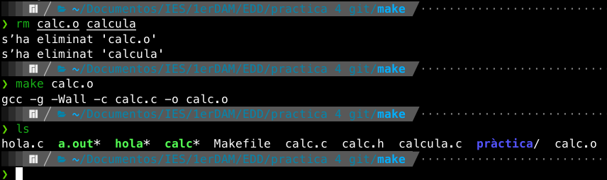

# Automatització amb make

{:toc}


## hola.c

### Proveu de llançar les ordres anteriors sobre el fitxer hola.c i comproveu el resultat executant els fitxers compilats


## Calculadora

### Creeu i compileu el primer programa de la calculadora per verificar que funciona

`calc.c`

```C
int suma(int op1, int op2)
{
    return (op1 + op2);
}

int resta(int op1, int op2)
{
    return (op1 - op2);
}

int multiplica(int op1, int op2)
{
    return (op1 * op2);
}

int divideix(int op1, int op2)
{
    return (op1 / op2);
}
```

`calc.h`

```C
#ifndef MYCALC
#define MYCALC

int suma(int op1, int op2);
int resta(int op1, int op2);
int multiplica(int op1, int op2);
int divideix(int op1, int op2);

#endif
```

`calcula.c`

```C
#include <stdio.h>
#include "calc.h"

int main()
{
    int a = 10;
    int b = 5;

    printf("La suma de %d i %d és %d\n", a, b, suma(a, b));
    printf("La resta entre %d i %d és %d\n", a, b, resta(a, b));
    printf("La multiplicació de %d i %d és %d\n", a, b, multiplica(a, b));
    printf("La divisió entre %d i %d és %d\n", a, b, divideix(a, b));
}
```


### Afegiu una nova funció que es diga major i que retornarà quin dels dos números és el major

Imprimirem el resultat com en la resta de casos, de forma, que l'última línia que mostre siga algo semblant a: El major entre 10 i 5 és 10.

Una vegada comprovat el funcionament, feu el mateix amb el segon exemple, afegint les modificacions corresponents a cada fitxer. Compileu el segon exemple i verifiqueu que tot funciona correctament

`calc.c`

```C
int suma(int op1, int op2)
{
    return (op1 + op2);
}

int resta(int op1, int op2)
{
    return (op1 - op2);
}

int multiplica(int op1, int op2)
{
    return (op1 * op2);
}

int divideix(int op1, int op2)
{
    return (op1 / op2);
}

int major(int op1, int op2)
{
    if ( op1 > op2){
        return op1;
    }else{
        return op2;
    }
        
}
```

`calc.h`

```C
#ifndef MYCALC
#define MYCALC

int suma(int op1, int op2);
int resta(int op1, int op2);
int multiplica(int op1, int op2);
int divideix(int op1, int op2);
int major(int op1, int op2);

#endif
```

`calcula.c`

```C
#include <stdio.h>
#include "calc.h"

int main()
{
    int a = 10;
    int b = 5;

    printf("La suma de %d i %d és %d\n", a, b, suma(a, b));
    printf("La resta entre %d i %d és %d\n", a, b, resta(a, b));
    printf("La multiplicació de %d i %d és %d\n", a, b, multiplica(a, b));
    printf("La divisió entre %d i %d és %d\n", a, b, divideix(a, b));
    printf("El major entre  %d i %d és %d\n", a, b, major(a, b));
}
```


### Creeu el fitxer Makefile i proveu de construïr els diferents objectius

Provant el resultat de `make`, `make calcula` i `make calc.o`. Esborra tots els fitxers objecte i executables entre cada prova.

```C
calcula: calcula.c calc.o
    gcc -Wall -g calcula.c calc.o -o calcula

calc.o: calc.c calc.h
    gcc -g -Wall -c calc.c -o calc.o
```




### Prova d'invertir l’ordre de les regles en el Makefile, primer la regla de calc.o i després calcula

Executa el `make` en aquest Makefile i explica els resultats.

```C
calc.o: calc.c calc.h
    gcc -g -Wall -c calc.c -o calc.o

calcula: calcula.c calc.o
    gcc -Wall -g calcula.c calc.o -o calcula
```


El que passa és que el `make` construeix per defecte el primer que indiquem.

### Restaura el fitxer Makefile amb l’ordre anterior

```C
calcula: calcula.c calc.o
    gcc -Wall -g calcula.c calc.o -o calcula

calc.o: calc.c calc.h
    gcc -g -Wall -c calc.c -o calc.o
```

```C
.PHONY: clean
clean:
    rm -rf *.o
```
